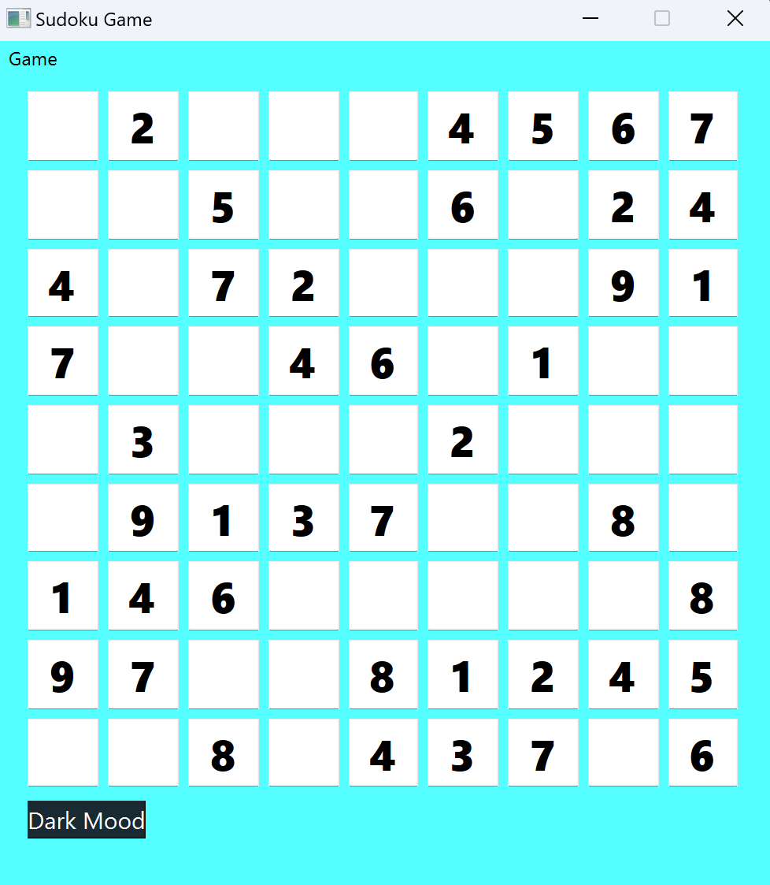

># Assigment 23


# Sudoku 🧩

**Sudoku** is a logic-based, combinatorial number-placement puzzle. In classic Sudoku, the objective is to fill a 9 × 9 grid with digits so that each column, each row, and each of the nine 3 × 3 subgrids that compose the grid contains all of the digits from 1 to 9. The puzzle setter provides a partially completed grid, which for a well-posed puzzle has a single solution.


## Description

This program is a simple Sudoku game with a graphical user interface, built using PySide6 and Python.


## Game menu


>### 1-New Game: 
By clicking this option, you can start a new game.

>### 2-Open File: 
By clicking on this file, you can give a desired input to your Sudoku game. The input should be a text file which is a 9x9 matrix containing numbers 1 to 9. The numbers in each row must be separated by a space, and each number that the user must complete must be 0.
    

>### 3-Sudoku Solve: 
By clicking on this option, your Sudoku will be solved automatically and the entered numbers will be displayed in blue

>### 4-Help: 
By clicking on this option, a summary of how to play the game will be displayed.


### 5-About: 
Displays information about the developer of this app

### 6-Exit: 
by clicking on this option, The game will be closed.


## Dark Mood and Light Mood: 

The theme of the game will be dark.

The theme of the game will be light.


>## How to Run
execute this command in terminal:
Run following command :
```
python main.py
```

>## How to install

To use the software, just run the ***dist/main.exe*** file


>## Results

The UI of Sudoku Game is shown below:




